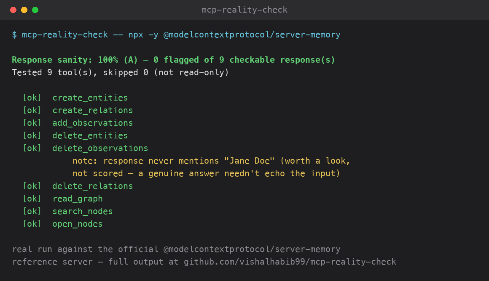

# mcp-reality-check

Checks whether an [MCP](https://modelcontextprotocol.io) server's *successful* tool responses actually reflect reality.



*Real output from a live `--include-destructive` run against the official [`@modelcontextprotocol/server-memory`](https://github.com/modelcontextprotocol/servers/tree/main/src/memory) reference server — not a synthetic example.*

[`mcp-doctor`](https://github.com/vishalhabib99/mcp-doctor) reads a server's source and never runs it. [`mcp-fuzz`](https://github.com/vishalhabib99/mcp-fuzz) runs it, but only judges the *bad*-input path — does a missing or wrong-typed field come back as a structured error, or does the server crash? It explicitly declines to judge a *successful* call's content, since a schema-only placeholder value (`"test"`) usually isn't realistic enough to fairly judge whether the response is actually correct.

`mcp-reality-check` is the piece that was missing: it calls each tool once with a best-effort *realistic* input, then checks whether the response is a genuine answer — not a disguised refusal, not empty, not silently violating the tool's own declared output schema.

## Why no LLM?

The obvious way to judge "is this response actually correct" is to have another LLM read it and decide. Deliberately didn't build it that way for v1: an LLM judge means an API key, a per-call cost, and non-deterministic results — a real cost and reliability tradeoff, not free. Every check here is instead a plain, deterministic rule, in the same spirit as `mcp-doctor` and `mcp-fuzz`: zero cost, zero API key, fully reproducible, run it as many times as you want. The real tradeoff is recall: a refusal phrased in a way the pattern list doesn't cover won't be caught. That's an honest limitation, not hidden — see [Known limitations](#known-limitations).

## Install

```bash
pip install mcp-reality-check
```

## Use

```bash
mcp-reality-check -- python server.py
mcp-reality-check -- npx -y some-mcp-server
mcp-reality-check --env BRAVE_API_KEY=... -- npx -y @brave/brave-search-mcp-server
```

By default, only a minimal, safe set of environment variables (`PATH`, `HOME`, ...) is passed to the target server — never your full shell environment. Many real servers need an API key or config just to register any tools at all; pass one through explicitly with `--env` (repeatable) rather than relying on the ambient environment.

Pass `--url` instead of `-- <command>` to connect to an already-running server over Streamable HTTP rather than launching a local stdio one:

```bash
mcp-reality-check --url https://example.com/mcp --header "Authorization=Bearer $TOKEN"
```

`--header` is the `--url` equivalent of `--env` — repeatable, `KEY=VALUE`. The two transports are mutually exclusive. One real difference: over stdio this tool owns the launched subprocess, so a tool that crashes the server is usually recoverable with a relaunch; over `--url` it has no way to relaunch a remote process it doesn't own — if a tool takes the server down for good, the run reports `terminated_early` with the tool that did it and marks everything after it as skipped, rather than crashing the whole run with an unhandled connection error (see mcp-fuzz's identical fix and fuller writeup for the failure mode this closes).

For each tool (read-only by default — see Safety below), `mcp-reality-check` generates one best-effort *realistic* set of arguments from the tool's own `inputSchema` (a `city` property gets a real city name, an `email` property gets a real-shaped email, not a bare placeholder), calls it once, and checks the response for:

- **Refusal in disguise** — the call reports success (`isError` false/absent), but the content is actually an apology or refusal ("I don't have access to...", "as an AI, I cannot..."). A real, common failure mode neither `mcp-doctor` nor `mcp-fuzz` catches, since both only ever look at the structural `isError` flag, never the text itself.
- **Empty content on success** — reports success, returns nothing.
- **Output schema violation** — if the tool declares an `outputSchema`, its actual `structuredContent` is validated against it. The one fully hard, non-heuristic check here.
- **Echo/relevance mismatch** *(reported separately, not scored)* — none of the realistic string inputs used in the call appear anywhere in the response. A weak signal on its own (a genuine, on-topic answer doesn't have to repeat the input verbatim), flagged as worth a manual look rather than folded into the score.

A tool that itself honestly reports `isError: true` is never flagged — it's already telling the truth about failing, which is the opposite of a disguised failure.

## Runtime gate — use it live, not just as a batch audit

Everything above runs once, offline, against synthetic-but-realistic arguments, to produce a report. `guarded_call` is the same checks applied to one real call an agent actually makes, with the agent's own real arguments — call-time instead of audit-time:

```python
from mcp_reality_check.gate import guarded_call

# in place of a bare `await session.call_tool(tool.name, arguments)`:
result = await guarded_call(session, tool, arguments)

if result.outcome != "ok":
    ...  # crashed or timed out — no response to trust
elif result.flagged:
    ...  # a real response came back, but it's a disguised refusal,
         # empty content, or violates the tool's own output schema
```

This is deliberately scoped to *correctness*, not *security* — is the response real, not is it safe. There's already good, actively-maintained tooling in the runtime-security-proxy space (secrets in transit, prompt-injection markers, destructive-command policy, taint tracking) — this doesn't compete with that and isn't trying to. It answers the question those tools don't: a tool call can be perfectly safe and still lie about what it did.

## Safety

Same default as `mcp-fuzz`: only tools annotated `readOnlyHint: true` are called. Pass `--include-destructive` to test everything, but only against a server you're confident is safe to call blindly. `guarded_call` has no opinion on this — the agent decides which real calls to make; the gate only judges the response.

## JSON output / CI

```bash
mcp-reality-check --json -- python server.py
mcp-reality-check --fail-under 90 -- python server.py   # non-zero exit if sanity < 90%
```

Want this alongside mcp-doctor's static checks and mcp-fuzz's crash-resilience checks in one PR comment instead of three? [`mcp-trust-check`](https://github.com/vishalhabib99/mcp-trust-check) is a single GitHub Action that runs all three and posts one combined score.

## Real-world spot check

| Repo | Lang | What mcp-reality-check found |
|---|---|---|
| [`modelcontextprotocol/server-everything`](https://github.com/modelcontextprotocol/servers/tree/main/src/everything) | TS | Official reference server, run via `npx`. Clean pass — 9/9 checkable tools, 100%/A. Includes `get-structured-content`, which declares a real `outputSchema` — confirmed the schema-validation check is actually exercised, not silently a no-op: read both the tool's declared schema and its live `structuredContent` directly off the wire before trusting the clean result. |
| [`haris-musa/excel-mcp-server`](https://github.com/haris-musa/excel-mcp-server) | Python | Clean pass — 4/4 checkable tools, 100%/A. 19 write tools correctly skipped as not read-only. |
| [`modelcontextprotocol/server-fetch`](https://pypi.org/project/mcp-server-fetch/) | Python | Clean pass, tested with `--include-destructive` (its one tool is genuinely read-only but isn't annotated as such) — 1/1, 100%/A, a real HTTP GET against a real URL. |
| [`upstash/context7-mcp`](https://github.com/upstash/context7) | TS | Clean pass — 2/2, 100%/A. |
| [`czlonkowski/n8n-mcp`](https://github.com/czlonkowski/n8n-mcp) | TS | Clean pass — 4/4 checkable tools, 100%/A. 3 more tools correctly recognized as honest `isError: true` failures rather than checked/flagged. |
| [`modelcontextprotocol/server-time`](https://pypi.org/project/mcp-server-time/) | Python | **Found a real bug in mcp-reality-check itself, not the target.** No `timezone` hint existed in the input generator at all, so `timezone`/`source_timezone`/`target_timezone` fell back to a bare "example timezone" string — not a valid IANA name. Every call errored ("Invalid timezone"), leaving 0/2 checkable. Fixed by adding a real IANA name (`America/New_York`) as the hint; also tightened the `time` hint to `HH:MM`, the format every real time-tool schema documents. Re-verified: 2/2 checkable, 100%/A. |
| [`modelcontextprotocol/server-sqlite`](https://pypi.org/project/mcp-server-sqlite/) | Python | Clean pass, tested with `--include-destructive` against a throwaway local db file — 6/6, 100%/A. |
| [`modelcontextprotocol/server-memory`](https://github.com/modelcontextprotocol/servers/tree/main/src/memory) | TS | Clean pass — 3/3 checkable tools, 100%/A. 6 mutating tools correctly skipped as not read-only. |
| [`mendableai/firecrawl-mcp-server`](https://github.com/mendableai/firecrawl-mcp-server) | TS | Run keyless (no API key) — most tools correctly report an honest `isError: true` since they need a key; the one free tool, `firecrawl_search`, passed cleanly (1/1, 100%/A). |
| [`wonderwhy-er/DesktopCommanderMCP`](https://github.com/wonderwhy-er/DesktopCommanderMCP) | TS | Clean pass — 8/8 checkable tools, 100%/A. 12 write/process-control tools correctly skipped as not read-only, exactly the kind of server this default exists to protect against. |
| [`modelcontextprotocol/server-git`](https://pypi.org/project/mcp-server-git/) | Python | 0/7 checkable — every call honestly errored, but for a reason no schema-only generator can fix: the server is configured against one fixed, specific repository path, and no property name or type in the schema signals that constraint. A real, inherent boundary of realistic-input generation, not a bug — documented below rather than forced. |
| [`qdrant/mcp-server-qdrant`](https://github.com/qdrant/mcp-server-qdrant) | Python | 0/2 checkable — reproduces the same `AsyncQdrantClient` embedded-local-storage-mode limitation already documented from `mcp-fuzz` dogfooding; not a new finding. |
| [`DeusData/codebase-memory-mcp`](https://github.com/DeusData/codebase-memory-mcp) | C | Native binary (darwin-arm64 release, checksum-verified), run with `--include-destructive`. 2/15 checkable, 100%/A on those — the other 13 honestly return `isError: true` (no project was ever indexed), so they're correctly excluded rather than scored. Same inherent boundary as `server-git`, one layer up the stack: this server's tools are only meaningfully checkable *after* a prior `index_repository` call succeeds, and none of the three tools in this family test stateful multi-call sequences (already a documented, deliberate stack-wide limitation, not new here). Corroborates rather than contradicts the clean `mcp-fuzz` pass on the same repo — see [that dogfooding entry](https://github.com/vishalhabib99/mcp-fuzz) and the [annotation-mislabeling issue it surfaced](https://github.com/DeusData/codebase-memory-mcp/issues/2118). |
| [`arabold/docs-mcp-server`](https://github.com/arabold/docs-mcp-server) | TS | Run via `npx` with `--include-destructive`. 6/10 checkable (the other 4 — `search_docs`, `find_version`, `get_job_info`, `cancel_job` — honestly return `isError: true` against a placeholder library/job ID, correctly excluded rather than scored). 0 flagged, **100%/A** on every checkable call. Part of a full three-tool pass on the same repo; see [mcp-doctor's entry](https://github.com/vishalhabib99/mcp-doctor) for two real security-heuristic false positives found there. |
| [`modelcontextprotocol/server-sequential-thinking`](https://github.com/modelcontextprotocol/servers/tree/main/src/sequentialthinking) | TS | Official reference server, run via `npx`, no credentials needed. Clean pass — 1/1 checkable tool, 100%/A. |
| [`Jpisnice/shadcn-ui-mcp-server`](https://github.com/Jpisnice/shadcn-ui-mcp-server) | TS | Run keyless with `--include-destructive` (none of its 10 tools are annotated read-only). Clean pass on the 6 checkable tools, 100%/A. `get_component`/`get_component_demo`'s echo-mismatch note (never mentions "Jane Doe") is the placeholder-input limitation, not a finding — `componentName` has no dedicated hint so it falls back to the generic "name" hint, and no schema-only generator can know it should look like `"accordion"` instead. |
| [`GongRzhe/Office-Word-MCP-Server`](https://github.com/GongRzhe/Office-Word-MCP-Server) | Python | Clean pass — 11/11 checkable tools, 100%/A, no notes at all. |
| [`financial-datasets/mcp-server`](https://github.com/financial-datasets/mcp-server) | Python | Run with a dummy API key (real calls fail with 400/401) with `--include-destructive` (none of its 11 tools are annotated read-only despite being pure data-fetch GETs). 100%/A by the current scoring — but a genuine, verified observation worth logging: `make_request` catches every exception (auth failure, a real 400) and every tool falls back to a generic `"Unable to fetch X or no X found"` message with `isError` left `false`, so a real upstream failure is indistinguishable from "this ticker genuinely has no data." Deliberately **not** added as a new scored pattern — the exact same phrasing is indistinguishable from an honest empty result for a placeholder ticker that simply doesn't exist, and the existing refusal patterns are conservative by design specifically to avoid this kind of false accusation across every other real target already verified clean. |
| [`oraios/serena`](https://github.com/oraios/serena) | Python | Run against a real Python language server (installed `uv`, which serena shells out to) rather than a stub target, with `--include-destructive`. 10/10 checkable tools (of 28 total real tools — the rest are write/edit operations, correctly out of scope for this tool's read-only sanity checks), 0 flagged, 100%/A. No disguised refusals, no echo mismatches, no output-schema violations — see [mcp-fuzz's pass on the same repo](https://github.com/vishalhabib99/mcp-fuzz) for the crash-resilience side of the same run, and [mcp-doctor's pass](https://github.com/vishalhabib99/mcp-doctor) for a real bug found there instead. |
| [`sooperset/mcp-atlassian`](https://github.com/sooperset/mcp-atlassian) | Python | **Found a real bug in mcp-reality-check itself, not the target — and it's the one that mattered most.** Run with dummy Jira/Confluence credentials via `--env`. First attempt: 0/0, nothing tested at all — because there was no `--env` flag to even try. This CLI had no way to pass an environment variable to the target server, at all, ever, despite the underlying engine already accepting one — mcp-atlassian (5.9k★) registers zero tools without Jira/Confluence config, so every API-key- or config-gated server was silently untestable. Added `--env` (mirroring `mcp-fuzz`'s identical, already-solved fix for `brave-search-mcp-server`), re-verified: 58 tested/40 skipped (matching `mcp-fuzz`'s tool count on the same server exactly), 24 checkable, 0 flagged, **100%/A**. Part of a full three-tool pass on the same repo — see [mcp-doctor's](https://github.com/vishalhabib99/mcp-doctor) and [mcp-fuzz's](https://github.com/vishalhabib99/mcp-fuzz) entries for the rest of it. |
| [`WillDent/pipedrive-mcp-server`](https://github.com/WillDent/pipedrive-mcp-server) | TS | First real `--url`/`--header` (Streamable HTTP) run — built from source, started with `MCP_TRANSPORT=http` and a dummy `PIPEDRIVE_API_TOKEN`, called with `--header "Authorization=Bearer ..."`. 16/16 tools connected over real HTTP with a real auth header; 0/16 checkable, and correctly so — every call honestly returns `isError: true` (the dummy token fails against the real Pipedrive API, and the server's own code reports that failure truthfully rather than disguising it), so nothing here is a disguised refusal to catch. Exactly the intended distinction: a checkable-count of 0 isn't a failed run, it's a server telling the truth. |

No disguised refusals or output-schema violations found yet in real target servers — an honest "nothing yet" is itself worth stating plainly rather than papering over with the echo-mismatch notes (which are real, but explicitly not a confirmed bug — see above). Three real bugs found so far were in mcp-reality-check itself, not any target: the timezone hint, the missing `--env` flag, and (see below) an unrecoverable-reconnect crash that only a remote HTTP target could actually trigger.

### Remote servers: an HTTP-only robustness bug, found building `--url`

Identical fix to [mcp-fuzz's](https://github.com/vishalhabib99/mcp-fuzz): the one reconnect-after-failure call always assumed relaunching would work, which is true almost every time for a stdio subprocess this tool owns and launches itself, but not true at all for a remote server reached via `--url` that a tool call has just killed — mcp-reality-check has no way to relaunch a process it doesn't own. Verified directly with the fixture's `kills_process` tool over a real Streamable HTTP connection: before the fix, the failed reconnect raised an unhandled `ConnectError` out of `run_reality_check`, crashing the whole run. Fixed by tracking `conn.unreachable` and reporting `report.terminated_early` with the tool that caused it, skipping everything after it instead. 6 new tests, including a real end-to-end HTTP run and a matching stdio test confirming the relaunch still succeeds there (`terminated_early` stays `None`).

### Hardened against malformed tool metadata

The same class of bug found in [mcp-fuzz's generator](https://github.com/vishalhabib99/mcp-fuzz) — prompted by [a dev.to comment](https://dev.to/vishalhabib99/i-built-three-tools-to-audit-mcp-servers-each-one-found-a-bug-in-itself-first-5dlc) pointing out that nothing tested the auditor's own robustness to bad `tools/list` metadata, only the target server's tool-call handling — turned out to exist here too, since both tools generate arguments from the same kind of schema. Hand-fed adversarial metadata crashed this module three ways: `properties` (or the whole schema) coming back as a non-object, and a schema nested a few thousand levels deep (`RecursionError`). A fourth case, `required` as a string instead of a list, didn't crash but silently mismatched via substring containment — arguably worse, since it looks like it worked. Fixed the same way as mcp-fuzz: type guards before every `.items()`/membership check, plus a 50-level depth cap. 4 new regression tests (33 total).

## Known limitations

- A disguised refusal has to start within the first 200 characters of the response, since a refusal *is* the answer. A phrase deeper in a long response is treated as a document quoting one. Added in 0.4.1 after reading real READMEs through `server-filesystem` flagged documentation as refusals. Over 12,445 real text files, flagged files went from 38 to 0, and all 12 refusal samples in the test set are still caught.
- The refusal-pattern list is a fixed set of common phrasings, not exhaustive — a model-specific or oddly-worded refusal can slip through uncaught. Patterns are deliberately conservative (full phrases, not single words like "sorry") to avoid false-flagging a genuine answer that happens to apologize for something unrelated.
- The echo/relevance check is a substring match, not semantic understanding — it can't tell a correct paraphrase from an actually-wrong answer. That's exactly why it's reported separately and never scored.
- Output schema validation only fires when a server actually declares one — most MCP servers today don't yet.
- No true semantic correctness judgment (an LLM reading the response and deciding if it's *right*) — a deliberate scope decision, not an oversight. If this ever becomes an opt-in mode, it'll need its own API key and will be documented as non-deterministic, unlike everything else here.
- The input generator only has schema and property names to work with, not server-side configuration state. A server whose valid input depends on something outside its own schema (`mcp-server-git`'s single fixed configured repository path, an id that must reference a record the server was already seeded with) will legitimately reject every realistic-looking call — real, honest `isError: true` results, not a bug in either side, just outside what a schema-only generator can ever know to supply.

## License

MIT
